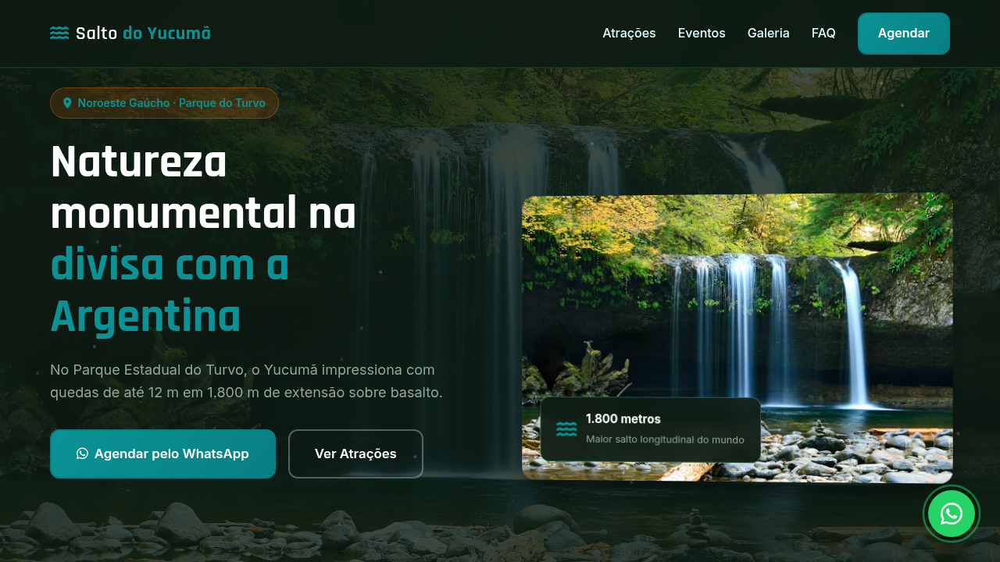
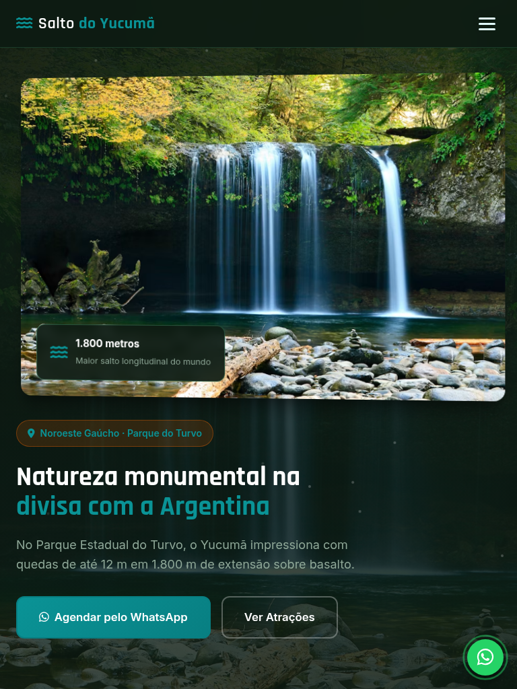
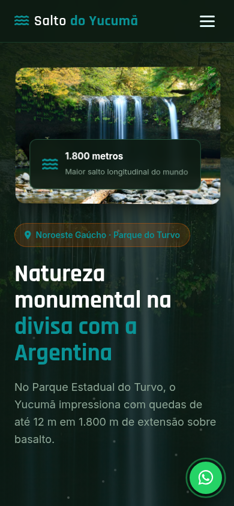

# Salto do Yucumã — Landing Page de Turismo

Landing page de alta conversão para turismo em **Salto do Yucumã** (Noroeste Gaúcho · Parque do Turvo), com atrações autênticas, eventos locais, galeria visual e agendamento estruturado via WhatsApp.

[](https://tofariasti.github.io/turismo-salto-do-yucuma/)

## Demo

**Moldura (preview):** [https://tofariasti.github.io/turismo-salto-do-yucuma/](https://tofariasti.github.io/turismo-salto-do-yucuma/)

**Tela cheia:** [https://tofariasti.github.io/turismo-salto-do-yucuma/site/](https://tofariasti.github.io/turismo-salto-do-yucuma/site/)

## Screenshots

### Desktop (1280px)


### Tablet (768px)


### Mobile (390px)


## Funcionalidades

- Design responsivo mobile-first com identidade visual regional
- Integração WhatsApp com formulário para agendar visita (nome, data, pessoas, roteiro)
- Animações AOS, partículas no hero, contadores e hover nos cards
- Seções: Hero, Como funciona, Atrações, Eventos, Galeria, FAQ e Contato
- Botão flutuante WhatsApp com pulse
- Acessibilidade: skip link, ARIA, contraste, foco visível, alt text
- Respeita `prefers-reduced-motion`
- Moldura iframe com preview desktop/tablet/mobile

## Pontos turísticos destacados

- **Salto do Yucumã** — Maior queda longitudinal do mundo — cortina de águas sobre rocha basáltica.
- **Parque Estadual do Turvo** — Maior reserva de mata atlântica do RS — onças-pintadas e aves raras.
- **Divisa Brasil-Argentina** — O Rio Uruguai separa os países — paisagem binacional única.
- **Mirante do Salto** — Vista da margem brasileira sobre o degrau basáltico e cortina branca.
- **Museu do Parque** — Informações sobre fauna, flora e geologia antes da trilha ao salto.
- **Combo Ametista do Sul** — Roteiro clássico de 2 dias: Yucumã + minas de ametista na região.

## Eventos

- **Melhor vazão do rio** (Mar–Mai) — Período de chuvas — quedas mais volumosas e espetaculares.
- **Semana da Patrimônio** (Set) — Atividades educativas sobre conservação no Parque do Turvo.
- **Ecoturismo e birdwatching** (Ano todo) — Observação de aves raras e trilhas guiadas na mata atlântica.
- **Férias de inverno** (Jul) — Alta temporada para famílias no roteiro noroeste gaúcho.

## Tecnologias

- HTML5 semântico · CSS3 · JavaScript vanilla
- AOS 2.3.4 · Font Awesome 6.4 · Google Fonts (Rajdhani + Inter)

## Screenshots (geração)

```bash
python3 -m http.server 8765
npm install
npm run screenshots
```

## Repositório

https://github.com/tofariasti/turismo-salto-do-yucuma

## Autor

**Tiago O. de Farias** — [Farias Digital](https://fariasdigital.com.br/)

---

<p align="center">
  <a href="https://tofariasti.github.io/turismo-salto-do-yucuma/">🌐 Demo Online</a> ·
  <a href="https://fariasdigital.com.br/">🏢 Site Comercial</a>
</p>
